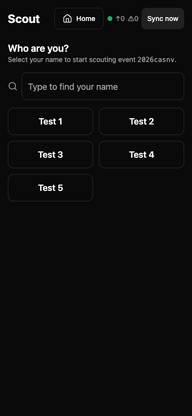
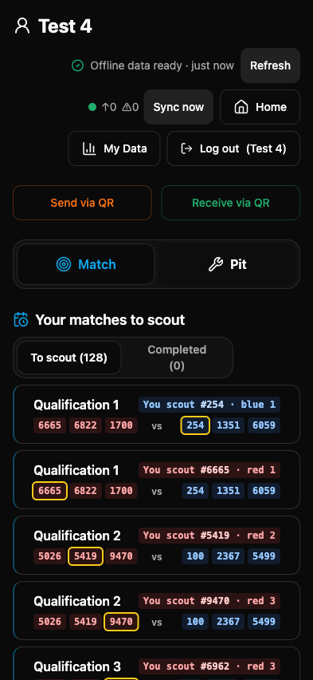
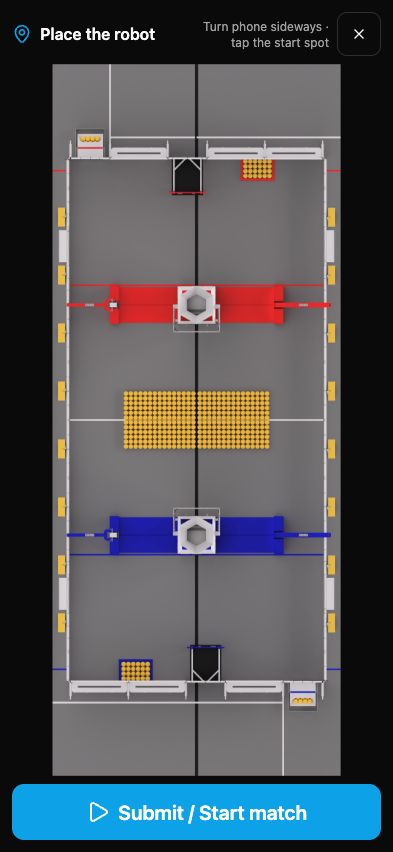
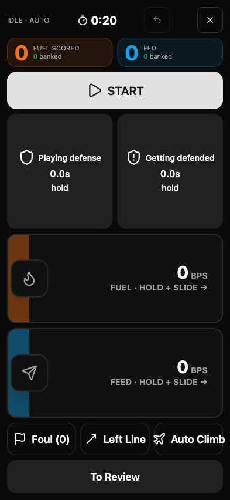
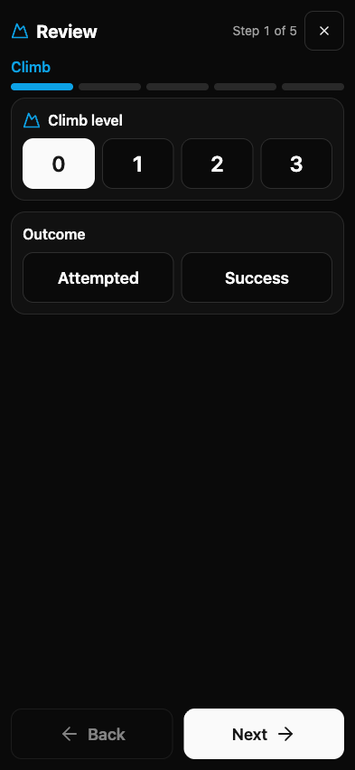
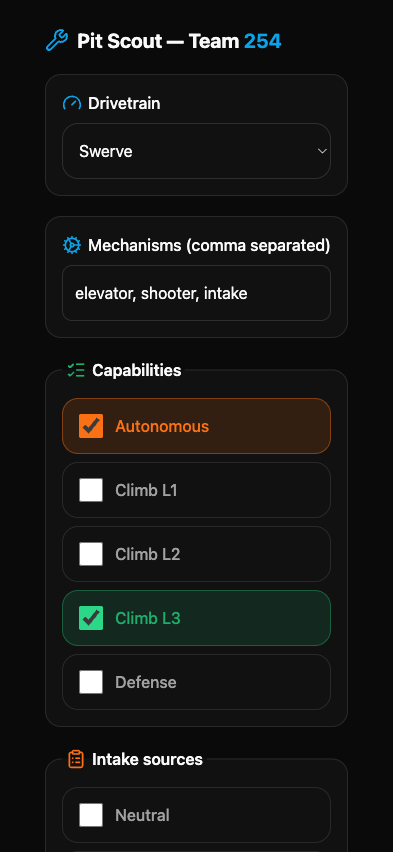
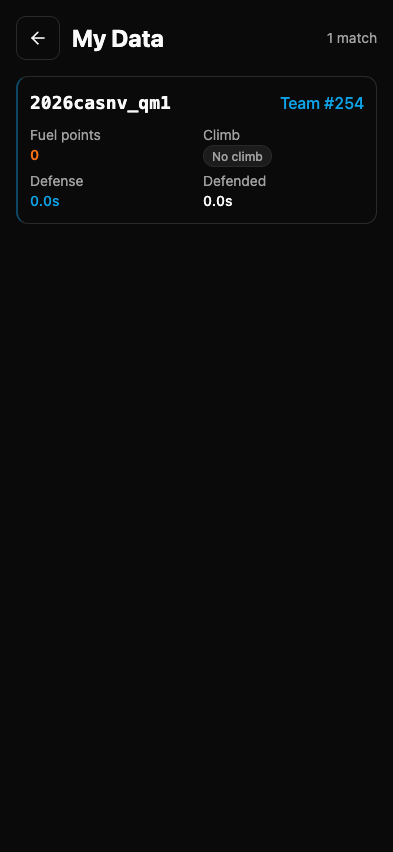
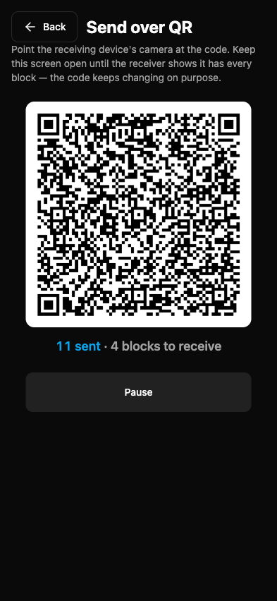
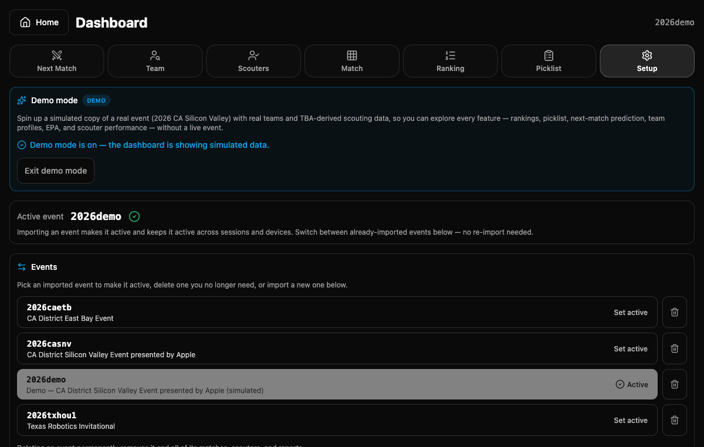
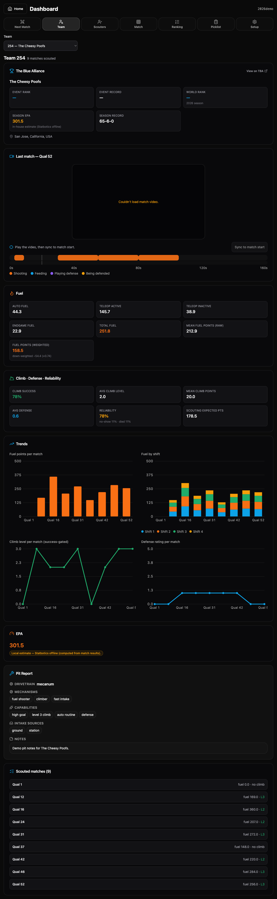

# FRC Scouting App

An offline-first scouting and strategy platform for **FRC team 3256**, built for the
2026 game **REBUILT presented by Haas**. It covers the whole competition loop — capturing
match and pit data from the stands, syncing it (even with no signal), and turning it into
live, broadcast-style strategy on the lead dashboard.

The app is a PWA: it installs to the home screen, runs in the pit or the stands, and keeps
working when the venue Wi-Fi drops.

```
React + TypeScript + Vite · Tailwind · TanStack Query · Zustand · Dexie (IndexedDB)
Supabase (Postgres + RLS + Edge Functions) · vite-plugin-pwa · ZXing QR · Vitest / Playwright
```

---

## Pick your station

Two roles, one fork. Scouts in the stands tap **Scout**; leads and drive coaches running
the show tap **Lead Dashboard**. There is no login wall — a silent anonymous session
satisfies row-level security, so anyone on the team is one tap from working.


---

## Main features

### 1. Next-Match broadcast dashboard

The dashboard's centerpiece. It anchors on **our team's next match** and fuses every data
source we have into one kiosk/driver-station view: the event livestream, event and season
rankings, live field status (On Field / Queuing) from FRC Nexus, and a full predicted
breakdown of both alliances.

- **Prominent win-probability banner.** A broadcast-style split bar crowns the red-vs-blue
  prediction, calling out each alliance's win odds and the projected score, with the
  favored side emphasized. (It replaces the old, easy-to-miss "Red win %" text line.)
- **Confidence-weighted prediction.** Each team's expected points blend our scouting data
  with EPA, weighted by how many matches we've actually scouted — degrading gracefully to
  scouting-only or EPA-only when a source is missing.
- **Cross-event (season carry-over) EPA.** EPA reflects a team's performance across **all**
  the events they've played this season, not just the current one — so a team arriving at
  its third event starts from the rating it earned at the first two. When Statbotics is
  available it's used directly; otherwise the same scalar-EPA model runs locally over
  TBA results, and results are cached so the view loads fast on repeat visits.


### 2. Offline-first match & pit scouting

Everything below is the **scout's side** of the app — the screens a team member runs from
their phone in the stands. They're built thumb-first for a real iPhone: big tap targets,
no login wall, and IndexedDB underneath so a flaky venue connection never costs a report.

#### Sign in with a tap — login-less identity

There's no password. A scout picks their name from the event roster; that one tap binds the
device's silent anonymous session to a per-event scout row, so RLS is satisfied without
anyone ever creating an account. A type-to-filter box keeps it fast when the roster is long.



#### Scout home — your matches, drafts, and sync at a glance

The home screen leads with **the matches assigned to this scout** (with a To-scout /
Completed split and the team they're watching highlighted), then a **manual pick** for
one-offs and **resumable drafts** so an interrupted match is never lost. The header carries
a live sync indicator (queued / failed counts), an "Offline data ready" badge, and one-tap
**Send / Receive via QR**. A single **Match / Pit** toggle switches between the two modes.



#### Match capture — place the robot on the REBUILT field

Capture opens on the actual **REBUILT presented by Haas** field render. The scout taps where
their robot starts, then submits to begin tracking the match — orienting the rest of the
capture flow to that alliance and station.



#### Live capture — slider-driven, built for a 2:30 match

The live screen is tuned for tracking a fast match without looking away from the field:
hold-and-slide **FUEL** and **FEED** rate sliders (banked vs. scored), one-tap **defense /
getting-defended** interval timers, and quick actions for **fouls**, **leave line**, and
**climbs** — all with a match clock, undo, and a running fuel/feed tally up top.



#### Guided review — confirm before you submit

After the match, a short **5-step review wizard** walks the scout through the things that are
easy to misremember in the moment (climb level & outcome, defense seconds, the auto path, a
final summary) so the saved report is clean. It saves locally first, then syncs.



#### Pit scouting — the same app, Pit mode

Flip the toggle to **Pit** and enter a team number to capture a robot's build: drivetrain,
mechanisms, capability checkboxes (autonomous, climb levels, defense), intake sources, free
notes, and a **robot photo**. Pit reports are offline-first and login-less too.



#### My Data — what this device has scouted

Every scout can review the reports they've submitted from this device — match key, target
team, and the key aggregates (fuel points, climb, defense / defended seconds) — to self-check
their work and spot anything that looks off.



#### QR transfer — move reports with no network at all

When the venue Wi-Fi is gone entirely, a scout opens **Send via QR** and the unsynced reports
stream out as an animated, fountain-coded QR sequence; the receiving device points its camera
and reassembles them (the block counter tracks progress until every frame lands). It's a
literal sneakernet for scouting data.



### 3. Resilient sync — built to survive a bad venue network

- **Local-first storage.** Reports persist to IndexedDB (Dexie) immediately and sync to
  Supabase when a connection is available.
- **Cache persistence.** The dashboard's TanStack Query cache is persisted to IndexedDB, so
  an offline reload rehydrates the last good data instead of hanging on spinners.
- **QR transfer.** When there's no network at all, reports move device-to-device by QR code
  (Send via QR / Receive via QR) and merge on the other side.

### 4. Scouter roster & performance

Manage who's scouting this event, track submission counts, and drill into any scouter's
submitted reports to spot gaps or disagreements.


### 5. Event setup

Import any event straight from its TBA key, switch the active event across sessions and
devices without re-importing, and set the "base team" the whole dashboard pivots around
(handy for testing events 3256 isn't registered at).


### 6. Analytics tabs

Beyond Next Match, the dashboard carries **Team**, **Match**, **Ranking**, and **Picklist**
views that aggregate scouting reports into rankings, per-team profiles, and pick-list
support once data is flowing for an event.

### 7. Demo mode

One toggle in **Setup → Demo mode** spins up a simulated event (`2026demo`) so you can explore
every feature without a live competition. Crucially, it's a **separate copy of a real event**
(2026 CA Silicon Valley) built from The Blue Alliance — **real team numbers and the real
qualification schedule** — so team-scoped features that need outside data (TBA team info,
nicknames, world rank, season record, and cross-event EPA) all resolve, not just the
scouting-only views. Scouting reports for each match are **generated from the actual TBA
results** (each alliance's score attributed across its teams), so rankings reflect real
team strength. The next-match prediction, team profiles, match-report compare, and scouter
performance all populate immediately. One click removes the demo event and all of its data.

The demo is built server-side by an idempotent `seed-demo` Edge Function (it fetches the
source event from TBA with a service-role client) and torn down via `delete_event`, so demo
mode never touches your real events.





---

## Architecture

- **Frontend** — React + TypeScript + Vite, styled with Tailwind. Routing via React Router
  with a per-route error boundary so no screen can blank the app. State via Zustand and
  TanStack Query (with IndexedDB persistence for offline reloads).
- **Local storage** — Dexie (IndexedDB) for scouting drafts and submitted reports;
  `idb-keyval` for the persisted query cache.
- **Backend** — Supabase Postgres with row-level security. Edge Functions proxy and
  enrich external data and ingest reports:
  - `tba-proxy` — The Blue Alliance (schedules, results, rankings, team info)
  - `statbotics-proxy` — Statbotics EPA
  - `nexus-proxy` — FRC Nexus live field status
  - `import-event` — import an event's schedule and teams from TBA
  - `ingest-reports` — accept and store scouting reports
  - `seed-demo` — build a demo event from a real TBA event with generated scouting data
- **PWA** — `vite-plugin-pwa` for installability and offline document serving.

External services degrade gracefully: every proxy returns an unavailability sentinel rather
than throwing, so a Statbotics, Nexus, or TBA outage never takes the dashboard down.

---

## Getting started

```bash
npm install

# Configure environment (Supabase URL + key, etc.)
cp .env.example .env.local
# then fill in the values

npm run dev          # start the dev server at http://localhost:5173
```

### Scripts

| Command | Description |
| --- | --- |
| `npm run dev` | Start the Vite dev server |
| `npm run build` | Type-check and build for production |
| `npm run preview` | Preview the production build |
| `npm test` | Run the unit/integration suite (Vitest) |
| `npm run test:e2e` | Run end-to-end tests (Playwright) |
| `npm run typecheck` | Type-check without emitting |

### Backend (Supabase)

Database migrations live in `supabase/migrations/` and Edge Functions in
`supabase/functions/`. With the Supabase CLI authenticated:

```bash
supabase db push                 # apply migrations
supabase functions deploy        # deploy the edge functions
```

The frontend deploys via Vercel on merge to `main`.

---

## Project layout

```
src/
  home/        Landing / role chooser
  capture/     Match scouting capture flow
  pit/         Pit scouting
  scout/       Scout-side data views
  dash/        Lead dashboard (Next Match, Team, Ranking, Picklist, Setup, …)
  qr/          Offline QR send/receive
  sync/        Sync status + engine
  scoring/     REBUILT scoring model
  roster/      Scouter identity & roster
  db/          Dexie (IndexedDB) stores
  lib/         Supabase client, query persistence, env
supabase/
  functions/   Edge Functions (proxies + ingest + import)
  migrations/  Postgres schema & RPCs
docs/          Game reference, design notes, screenshots
```
